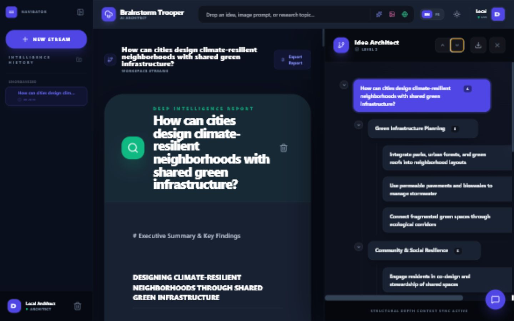

# Brainstorm Trooper

Brainstorm Trooper is a local-first React workspace for expanding ideas, creating mind maps, producing research-style dossiers, generating visual concept cards, and discussing the current workspace with MiniMax M3.



Google authentication and Firebase are not used. Projects and folders are stored locally in the browser.

## Local setup

Requirements: Node.js and a MiniMax key named `MINIMAX_API_KEY`.

This installation reuses the key already configured in:

```text
C:\Users\thoma\.hermes\.env
```

Start the installed app from PowerShell:

```powershell
.\Start-BrainstormTrooper.ps1
```

Then open `http://localhost:3002`.

For a different environment, set the key directly before starting:

```powershell
$env:MINIMAX_API_KEY = "your_key"
npm run dev
```

## Verification

```powershell
npm test
npm run build
```

The provider contract uses model `MiniMax-M3` and the OpenAI-compatible endpoint `https://api.minimax.io/v1/chat/completions`.

## Security

This remains a browser-only local application. Vite injects `MINIMAX_API_KEY` into the browser bundle, so use it only on a trusted machine. A public deployment should move MiniMax requests behind a server-side proxy.
