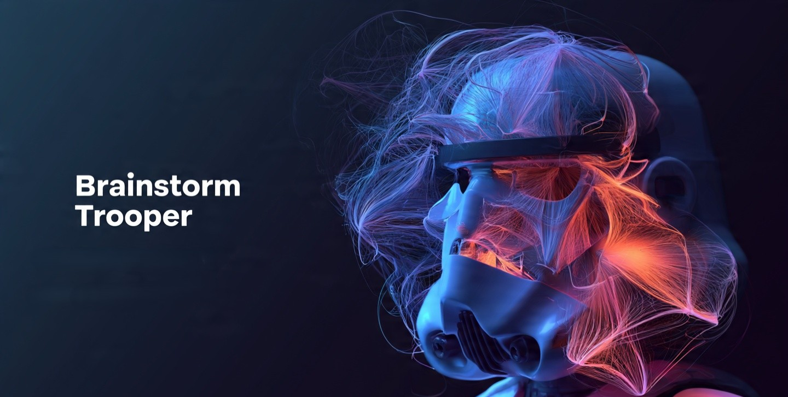
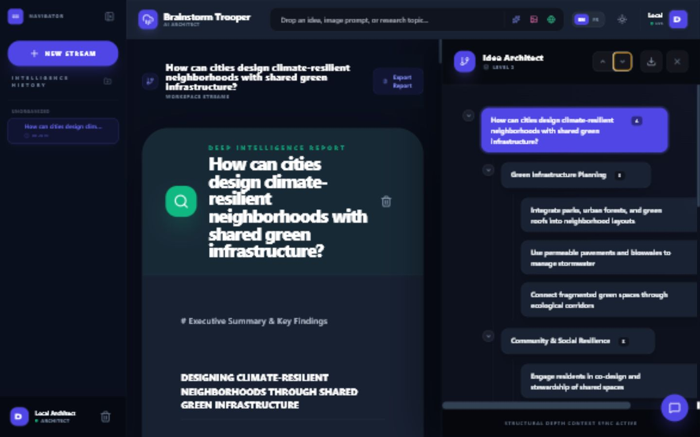
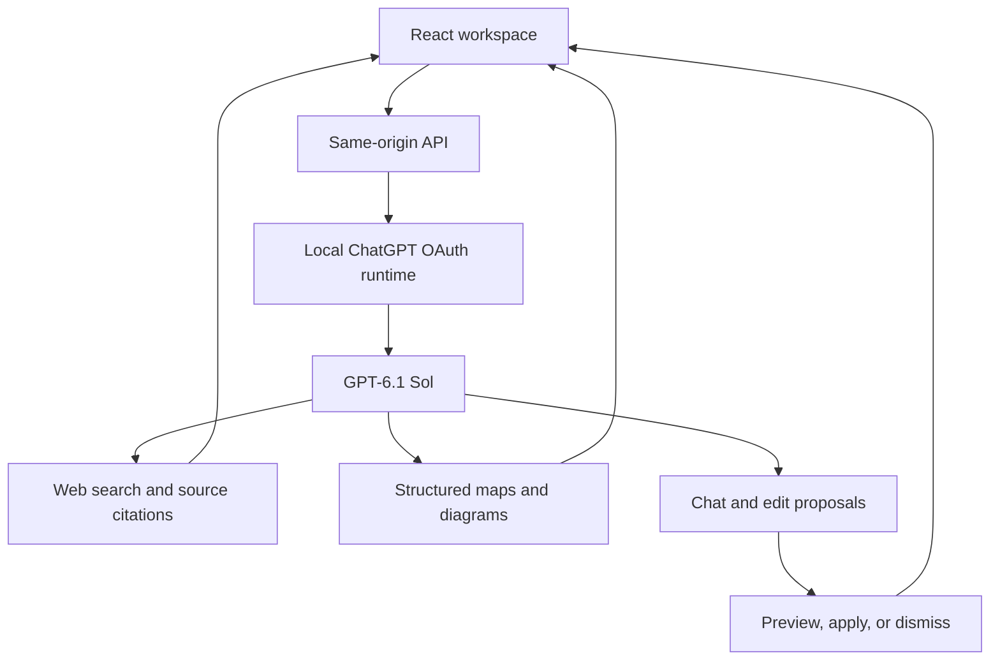

<div align="center">



# Brainstorm Trooper

**Follow an idea. Find the evidence. See the connections.**


A workspace for curious people: expandable mind maps, research dossiers, notes, relationship diagrams, and an assistant that understands the whole project.

[What changed](#september-2026-update) · [Get started](#get-started) · [How it works](#how-it-works) · [Verification](#verification)

</div>

## September 2026 update

This release replaces MiniMax with **GPT-6.1 Sol**, connects research to live web search, and gives the assistant your full mind map. Its proposed changes stay in a preview until you apply them.

| Explore | New behavior |
| :--- | :--- |
| **Research a question** | The Responses API must use web search. Reports retain returned sources, clickable citations, and a retrieval timestamp. Prompts request source disagreements, uncertainty, and publication dates when the evidence establishes them. Unsourced responses fail clearly. |
| **Talk to your project** | Chat sees notes, research, source links, and every mind-map node. It can propose additions, renames, moves, and removals with reasons. Review the resulting tree, apply it, or dismiss it; undo is available while the map remains unchanged. |
| **Explain a relationship** | Generate a real diagram with labelled concepts and directed relationships. An accompanying text list keeps the relationships readable and accessible. Previously saved image cards remain supported. |
| **Connect your ChatGPT plan** | The local Windows app uses the official Sign in with ChatGPT runtime. OAuth credentials are encrypted for your Windows user. The private Site provides the workspace; hosted AI requires an approved hosted integration. |

The existing dark/light themes, English/French outputs, project folders, research archive, recursive map editor, FreeMind exports, and Word-compatible reports remain available. Report exports include the diagram’s concepts and relationships.

### The workspace



*Existing workspace screenshot. This release retains the layout and adds sourced research, diagram cards, and a new chat edit preview. It is not a screenshot of a live GPT response from this release.*

### Try these prompts

- **Research:** “What do primary sources say about the benefits and limits of small language models on Android?”
- **Chat:** “Which two branches overlap? Suggest a clearer structure and show the edits.”
- **Diagram:** “Explain how model size, memory, quantization, and latency affect local AI.”

## Get started

Use **Windows, Node.js 22 or later**, and an eligible ChatGPT account. No API key is required.

```bash
npm ci
```

Then launch the app:

```bash
npm run dev
```

Open `http://127.0.0.1:3002`. You can also run `Start-BrainstormTrooper.ps1`, which installs missing dependencies and launches the app.

### Local ChatGPT connection

Choose **Continue with ChatGPT**, sign in in your system browser, and allow ChatGPT plan usage when asked. Eligible requests count toward your existing plan limits. Available models and tools depend on your account and selected workspace; this app requests `gpt-6.1-sol` and research requires web search.

The official runtime handles registration, consent, PKCE, identity validation, token refresh, and completed response streams. The server stores credentials in the ignored `.brainstorm-auth/` directory, encrypted with Windows DPAPI for your Windows user. Use **Disconnect** to remove the local connection. Account authorization and usage settings can also be managed in ChatGPT.

[OpenAI local OAuth documentation](https://developers.openai.com/siwc/token-sharing-open-source) · [Official runtime and included modifications](vendor/README.md)

## How it works


```mermaid
flowchart TD
  A["React workspace"] --> B["Same-origin API"]
  B --> O["Local ChatGPT OAuth runtime"]
  O --> C["GPT-6.1 Sol"]
  C --> D["Web search and source citations"]
  C --> E["Structured maps and diagrams"]
  C --> F["Chat and edit proposals"]
  D --> A
  E --> A
  F --> G["Preview, apply, or dismiss"]
  G --> A
```

- **Model:** `gpt-6.1-sol`, with `reasoning.effort: "low"` — the API setting used here for “light.”
- **Endpoint:** `https://api.openai.com/v1/responses`.
- **Structured output:** strict JSON schemas for ideas, branches, maps, diagrams, and chat proposals.
- **Research:** `web_search` is required; returned web citations and consulted-source metadata populate the report. Publication dates are not inferred from retrieval timestamps.
- **Storage:** projects and folders stay in this browser’s local storage. This is device-local storage, not cloud sync. A new Sites origin cannot read data from the localhost origin.
- **Data sent for AI:** a topic for generation; relevant project notes, research, map, and recent conversation for chat. Requests use your authorized OAuth token with `store: false` and `stream: true`. Review the ChatGPT consent and data settings; AI inference uses OpenAI's online service.
- **Browser agent support:** when `document.modelContext` is available, agents can read the current project or stage a topic in the input. Staging does not call AI or apply edits. Unsupported browsers continue normally.

## Sites hosting

The Site identity lives in `.openai/hosting.json`. Keep it when updating this Site; do not register a second project.

Run verification and build the project, then use the Sites workflow to push the exact source, package its output, and publish a private version.

```bash
npm run build
```

The build emits:

```text
dist/
  client/       React app and static assets
  server/       Cloudflare-compatible Worker
  .openai/      Hosting manifest
```

The Worker serves the client through `ASSETS` and exposes connection status. The workspace and saved project tools work online. AI requests explain that a local connection is required until a hosted integration is approved. New Sites are private.

**Hosted AI:** local OAuth consent does not approve a remotely hosted service. OpenAI directs remotely hosted apps to its [Sign in with ChatGPT interest form](https://openai.com/form/sign-in-with-chatgpt-interest/). Request **Sign in and ChatGPT plan use for AI requests**. This app has not received that approval; the Worker contains no OAuth tokens or API key.

## Verification

```bash
npm run typecheck
npm test
npm run build
node scripts/validate-build.mjs
```

Automated checks cover required research search calls, source extraction, map-edit safeguards, diagram relationships, citation rendering, local OAuth routes, request validation, credential isolation, and Worker routing. Transport tests verify the runtime's public Responses endpoint, OAuth authorization, structured request options, and rejection of incomplete streams. A Windows DPAPI round-trip checks actual credential encryption. Provider calls are mocked; passing tests do not establish live model or tool access.

A user must complete OAuth consent before live AI can be checked. WebMCP needs a supporting browser. Browser visual QA was unavailable in this release's build environment.

## Security and limits

- OAuth credentials remain in the local server's encrypted store. The browser receives connection status and identity display information, never tokens.
- Cross-origin AI requests are rejected. Input and output sizes are bounded, provider errors are sanitized, and AI responses are not cached.
- The hosted app relies on the private Sites access boundary. Do not make it public without adding application authentication and usage controls.
- Model output remains fallible. Open the original sources before relying on a research claim.
- Mind-map edits are validated before preview; stale previews cannot overwrite a newer map. Moves cannot introduce cycles, and the root cannot be moved or removed.
- Chat is scoped to the current project and resets when switching projects. Projects persist locally; chat history does not persist across reloads.
