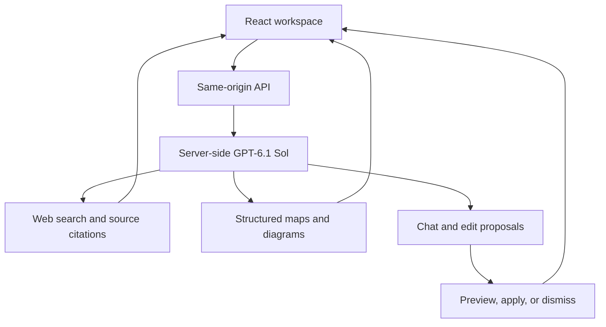

<div align="center">


# Brainstorm Trooper

**Follow an idea. Find the evidence. See the connections.**


A workspace for curious people: expandable mind maps, research dossiers, notes, relationship diagrams, and an assistant that understands the whole project.

[What changed](#september-2026-update) · [Get started](#get-started) · [How it works](#how-it-works) · [Verification](#verification)

</div>

## September 2026 update

This release replaces MiniMax with **GPT-6.1 Sol**, connects research to live web search, and gives the assistant your full mind map. Its proposed changes stay in a preview until you apply them.

| Explore | New behavior |
| :--- | :--- |
| **Research a question** | The Responses API must use web search. Reports retain returned sources, clickable citations, and a retrieval timestamp. Prompts request source disagreements, uncertainty, and publication dates when the evidence establishes them. Unsourced responses fail clearly. |
| **Talk to your project** | Chat sees notes, research, source links, and every mind-map node. It can propose additions, renames, moves, and removals with reasons. Review the resulting tree, apply it, or dismiss it; undo is available while the map remains unchanged. |
| **Explain a relationship** | Generate a real diagram with labelled concepts and directed relationships. An accompanying text list keeps the relationships readable and accessible. Previously saved image cards remain supported. |
| **Use it online** | Cloudflare Worker output is prepared for Sites. OpenAI credentials remain on the server. The app clearly shows when AI has not been connected. |

The existing dark/light themes, English/French outputs, project folders, research archive, recursive map editor, FreeMind exports, and Word-compatible reports remain available. Report exports include the diagram’s concepts and relationships.

### The workspace


*Existing workspace screenshot. This release retains the layout and adds sourced research, diagram cards, and a new chat edit preview. It is not a screenshot of a live GPT response from this release.*

### Try these prompts

- **Research:** “What do primary sources say about the benefits and limits of small language models on Android?”
- **Chat:** “Which two branches overlap? Suggest a clearer structure and show the edits.”
- **Diagram:** “Explain how model size, memory, quantization, and latency affect local AI.”

## Get started

Use **Node.js 22 or later** and an OpenAI API project with access to `gpt-6.1-sol`.

```bash
npm ci
```

Create `.env.local` in the project root:

```dotenv
OPENAI_API_KEY=your_openai_api_key
```

Then launch the app:

```bash
npm run dev
```

Open `http://localhost:3002`. On Windows, `Start-BrainstormTrooper.ps1` launches the same development server and reads the same environment configuration.

**Keep the key private.** Do not use a `VITE_` key, paste a key into the browser, or commit an environment file. `.env.example` contains the expected variable name without a credential.

## How it works


```mermaid
flowchart TD
  A["React workspace"] --> B["Same-origin API"]
  B --> C["Server-side GPT-6.1 Sol"]
  C --> D["Web search and source citations"]
  C --> E["Structured maps and diagrams"]
  C --> F["Chat and edit proposals"]
  D --> A
  E --> A
  F --> G["Preview, apply, or dismiss"]
  G --> A
```

- **Model:** `gpt-6.1-sol`, with `reasoning.effort: "low"` — the API setting used here for “light.”
- **Endpoint:** `https://api.openai.com/v1/responses`.
- **Structured output:** strict JSON schemas for ideas, branches, maps, diagrams, and chat proposals.
- **Research:** `web_search` is required; returned web citations and consulted-source metadata populate the report. Publication dates are not inferred from retrieval timestamps.
- **Storage:** projects and folders stay in this browser’s local storage. This is device-local storage, not cloud sync. A new Sites origin cannot read data from the localhost origin.
- **Data sent for AI:** a topic for generation; relevant project notes, research, map, and recent conversation for chat. Requests set `store: false`. OpenAI API data policies still apply; local storage does not make AI inference offline.
- **Browser agent support:** when `document.modelContext` is available, agents can read the current project or stage a topic in the input. Staging does not call AI or apply edits. Unsupported browsers continue normally.

## Sites hosting

The Site identity lives in `.openai/hosting.json`. Keep it when updating this Site; do not register a second project.

1. Configure `OPENAI_API_KEY` as a **Sites secret**, using the OpenAI Developers plugin’s secure API-key workflow.
2. Run verification and build the project.
3. Use the Sites workflow to push the exact source, package its output, and publish a private version.

```bash
npm run build
```

The build emits:

```text
dist/
  client/       React app and static assets
  server/       Cloudflare-compatible Worker
  .openai/      Hosting manifest
```

The Worker routes `/api/ai` and `/api/status` and serves the client through `ASSETS`. New Sites are private. The application itself introduces no Google or Firebase login.

**Release readiness:** source, automated checks, and the deployable package can be prepared without a key. Live AI verification and Sites deployment require the server secret. This repository does not contain an API credential.

## Verification

```bash
npm run typecheck
npm test
npm run build
node scripts/validate-build.mjs
```

Automated checks cover the exact provider contract, required research search calls, source extraction and citation deduplication, map-edit safeguards, diagram relationships, safe citation rendering, request validation, credential isolation, and Worker routing. Provider calls in these tests are mocked: passing tests do not establish live model access or available API quota.

A browser supporting WebMCP and a live OpenAI key are needed for their respective end-to-end checks. Browser visual QA was unavailable in this release’s build environment.

## Security and limits

- The client never receives the OpenAI key; development requests and hosted requests both use a server endpoint.
- Cross-origin AI requests are rejected. Input and output sizes are bounded, provider errors are sanitized, and AI responses are not cached.
- The hosted app relies on the private Sites access boundary. Do not make it public without adding application authentication and usage controls.
- Model output remains fallible. Open the original sources before relying on a research claim.
- Mind-map edits are validated before preview; stale previews cannot overwrite a newer map. Moves cannot introduce cycles, and the root cannot be moved or removed.
- Chat is scoped to the current project and resets when switching projects. Projects persist locally; chat history does not persist across reloads.
